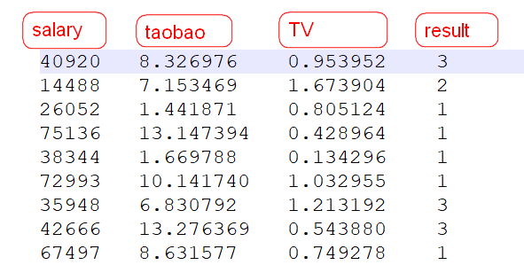

### KNN(K近邻)算法

```markdown
1. 赵老师找对象，约会了1000个女生，统计了一些相关数据
 结果：
 	1：周六日约
 	2：平时约
 	3：不约
 
 赵老师希望我们可以帮他写一个程序，他告诉我们这个女生的salary,taobao,tv，我们告诉他这个女生应该什么时候约或者不约(类别)
 
 (48111,9.134528,0.728045) 
 
 如何判断一个人是好人，还是坏人？
 	1. 询问他身边的人
 	2. 如果他身边的人好人多，坏人少，认为他是个好人
 	3. 反之，是个坏人
 物以类聚人以群分，近朱者赤近墨者黑
```



#### 思路如何产生

```markdown
1. 不同类别女生之间有没有区别？  假设有
2. 如果有区别，区别在哪？  和年龄，长相等有没有关系？没有关系  区别在salary taobao tv
3. 区别在于特征的值 很难直接找到一个或者多个确定的条件来判断女生的类别
4. 能不能找到待预测的女生比较接近的人	
	1. 如何判断两个样本之间的距离  使用欧式距离
5. 找到距离最近的前k个人  5
6. 统计前k个人中，出现次数最多的那个类别作为待遇测女生的类别
```


$欧式距离：d=\sqrt{\sum_{i=1}^n(x_i-y_i)^2}$

#### KNN开发思路(开发流程)

```markdown
1. 读取数据，分开特征矩阵和目标向量
2. 归一化特征矩阵
3. 计算新样本到所有样本之间的距离  计算方式使用欧式距离
4. 找到距离新样本最近的前k个样本 k值的选择凭经验 3-15个 最好是奇数
5. 统计出现次数最多的那个类别 
6. 将该类别作为新样本的类别输出
```

#### 归一化

```markdown
1. 将特征值放缩到一定区间(0-1)，放缩前后，每列特征对于别的特征没有影响
2. 最大最小值归一化
```

$最大最小值归一化:x=\frac{x-min}{max-min}$

#### 原版KNN实现

```python
# !/usr/bin/python
# -*- coding: utf-8 -*-
# @Time    : 2020/2/21 10:27
# @Author  : hbw
# @File    : KNN算法.py
# @Software: PyCharm
# 1. 读取数据，分开特征矩阵和目标向量
from collections import Counter


def load(filename):
    X = []
    Y = []
    with open(filename)as r:
        lines = r.readlines()
    for line in lines:
        datas = line.split('\t')
        X.append([float(d) for d in datas[:3]])
        Y.append(datas[-1].strip())
    return X, Y

# 归一化
def guiyihua(X):
    # 获取每一列
    l1,l2,l3=[],[],[]
    for x in X:
        l1.append(x[0])
        l2.append(x[1])
        l3.append(x[2])
    # 获取每列的最大值和最小值
    max1,min1=max(l1),min(l1)
    max2, min2 = max(l2), min(l2)
    max3, min3 = max(l3), min(l3)
    # 重新赋值每一列
    new_X=[]
    for i in range(len(l1)):
        new_X.append([(l1[i]-min1)/(max1-min1),(l2[i]-min2)/(max2-min2),(l3[i]-min3)/(max3-min3)])
    return new_X
# 分类
def classify(X, x, Y, k):
    dis = []
    # 2. 计算新样本到所有样本之间的距离  计算方式使用欧式距离
    for xx in X:
        dis.append(((xx[0] - x[0]) ** 2 + (xx[1] - x[1]) ** 2 + (
        xx[2] - x[2]) ** 2) ** 0.5)
    # 3. 找到距离新样本最近的前k个样本 k值的选择凭经验 3-15个 最好是奇数
    new_dis = sorted(dis)[:k]
    y = []
    for d in new_dis:
        index = dis.index(d)
        y.append(Y[index])
    # 4. 统计出现次数最多的那个类别
    # 5. 将该类别作为新样本的类别输出
    return Counter(y).most_common(1)[0][0]


if __name__ == '__main__':
    filename = r'E:\人工智能训练营\人工智能\笔记\day2\dating.txt'
    X, Y = load(filename)
    X=guiyihua(X)
    print(X)
    x = [48111, 9.134528, 0.728045]  # 3
    train_X = X[:900]
    test_X = X[900:]
    train_Y = Y[:900]
    test_Y = Y[900:]
    for k in [3,5,7,9,11]:
        count = 0
        for i,x in enumerate(test_X):
            y = classify(X, x, Y, k)
            if y==test_Y[i]:
                count+=1
        print(count/100)
```

#### 原版KNN的问题(优化思路)

```markdown
1. 代码可重用性不高，很差
	1. 部分代码写死了
2. 代码不够简洁优雅
```

#### 优化版KNN代码实现

```python
# !/usr/bin/python
# -*- coding: utf-8 -*-
# @Time    : 2020/2/21 10:27
# @Author  : hbw
# @File    : KNN算法.py
# @Software: PyCharm
# 1. 读取数据，分开特征矩阵和目标向量
from collections import Counter
import random


def load(filename, sep='\t'):  # ,usrcols=[0,2]
    X, Y = [], []
    with open(filename)as r:
        for line in r.readlines():
            datas = line.split(sep)
            X.append([d.strip() for d in datas[:-1]])
            Y.append(datas[-1].strip())
    return X, Y


# 归一化  1000,3
def guiyihua(X):
    new_X = []
    # 列数
    for i in range(len(X[0])):  # 3
        # 遍历每一列,获取每列的元素
        col = [float(x[i]) for x in X]
        # 获取每列最大值和每列最小值
        max_col, min_col = max(col), min(col)
        # 归一化每列的值
        new_col = [(c - min_col) / (max_col - min_col) for c in col]
        # len(X[0]),len(new_col)
        new_X.append(new_col)
    return [[new_X[j][i] for j in range(len(new_X))] for i in range(len(new_X[0]))]


# 分类
def classify(X, x, Y, k):
    dis = []
    # 2. 计算新样本到所有样本之间的距离  计算方式使用欧式距离
    for xx in X:
        sum = 0
        for i in range(len(x)):
            sum += (xx[i] - x[i]) ** 2
        dis.append(sum ** 0.5)
    # 3. 找到距离新样本最近的前k个样本 k值的选择凭经验 3-15个 最好是奇数
    # 4. 统计出现次数最多的那个类别
    # 5. 将该类别作为新样本的类别输出
    return Counter([Y[dis.index(d)] for d in sorted(dis)[:k]]).most_common(1)[0][0]


# 随机分割训练集和测试集
def train_test_split(X, Y, test_size=0.2):
    test_X, test_Y = [], []
    n = len(X) * 0.2
    while len(test_X) < n:
        index = random.choice(range(len(X)))
        test_X.append(X.pop(index))
        test_Y.append(Y.pop(index))
    return X, test_X, Y, test_Y


if __name__ == '__main__':
    filename = r'E:\人工智能训练营\人工智能\笔记\day2\dating.txt'
    X, Y = load(filename)
    X = guiyihua(X)
    # print(X)
    # print(Y)
    x = [48111, 9.134528, 0.728045]  # 3
    # train_X, test_X, train_Y, test_Y = train_test_split(X, Y)
    # count = 0
    # for i, x in enumerate(test_X):
    #     y = classify(train_X, x, train_Y, 3)
    #     if y == test_Y[i]:
    #         count += 1
    # print(count / len(test_X))
    print(classify(X,x,Y,3))
```

#### 优化版KNN的问题

```markdown
1. 代码可重用性还是很差，还是有冗余代码
```

#### 封装KNN

```markdown
1. 需要写几个类
	1. KNN
	2. Util
2. 每个类的属性
	1. KNN：k
3. 每个类的方法
	1. KNN：
		1. 分类器
		2. 评估方法
	2. Util：
		1. 加载数据
		2. 归一化
		3. 拆分数据集
```

#### 封装KNN的实现

```python
# !/usr/bin/python
# -*- coding: utf-8 -*-
# @Time    : 2020/2/21 10:27
# @Author  : hbw
# @File    : KNN算法.py
# @Software: PyCharm
# 1. 读取数据，分开特征矩阵和目标向量
from collections import Counter
import random


class Base(object):
    # 该方法必须让子类重写
    def classify(self, X, x, Y):
        raise ValueError('classify方法必须重写！！！')

    # 该方法不能被覆盖
    def score(self, train_X, test_X, train_Y, test_Y):
        count = 0
        for i, x in enumerate(test_X):
            y = self.classify(train_X, x, train_Y)
            if y == test_Y[i]:
                count += 1
        return count / len(test_X)

class KNN(Base):
    def __init__(self, k):
        self.k = k

    def classify(self, X, x, Y):
        dis = []
        for xx in X:
            sum = 0
            for i in range(len(x)):
                sum += (xx[i] - x[i]) ** 2
            dis.append(sum ** 0.5)
        return Counter([Y[dis.index(d)] for d in sorted(dis)[:self.k]]).most_common(1)[0][0]


class Util(object):
    def load(self, filename, sep='\t'):  # ,usrcols=[0,2]
        X, Y = [], []
        with open(filename)as r:
            for line in r.readlines():
                datas = line.split(sep)
                X.append([d.strip() for d in datas[:-1]])
                Y.append(datas[-1].strip())
        return X, Y

    def train_test_split(self, X, Y, test_size=0.2):
        test_X, test_Y = [], []
        n = len(X) * 0.2
        while len(test_X) < n:
            index = random.choice(range(len(X)))
            test_X.append(X.pop(index))
            test_Y.append(Y.pop(index))
        return X, test_X, Y, test_Y

    def guiyihua(self, X):
        new_X = []
        for i in range(len(X[0])):  # 3
            col = [float(x[i]) for x in X]
            max_col, min_col = max(col), min(col)
            new_col = [(c - min_col) / (max_col - min_col) for c in col]
            new_X.append(new_col)
        return [[new_X[j][i] for j in range(len(new_X))] for i in range(len(new_X[0]))]


# class KNN1(Base):
#     def classify(self, X, x, Y):
#         return '1'
#
#     def score(self, train_X, test_X, train_Y, test_Y):
#         return 1
#
#
# class KNN2(Base):
#     def classify(self, X, x, Y):
#         return '2'
#
#     def score(self, train_X, test_X, train_Y, test_Y):
#         return 0


class KNN3(Base):
    def classify(self, X, x, Y):
        return '3'

class KNN4(Base):
    def score(self, train_X, test_X, train_Y, test_Y):
        return 1

if __name__ == '__main__':
    filename = r'E:\人工智能训练营\人工智能\笔记\day2\dating.txt'
    util = Util()
    X, Y = util.load(filename)
    X = util.guiyihua(X)
    train_X, test_X, train_Y, test_Y = util.train_test_split(X, Y)
    knn = KNN(3)
    knn4 = KNN4()
    knn3 = KNN3()
    # print(main(knn4, filename))
    print(knn.classify(train_X,test_X[0],train_Y))


```